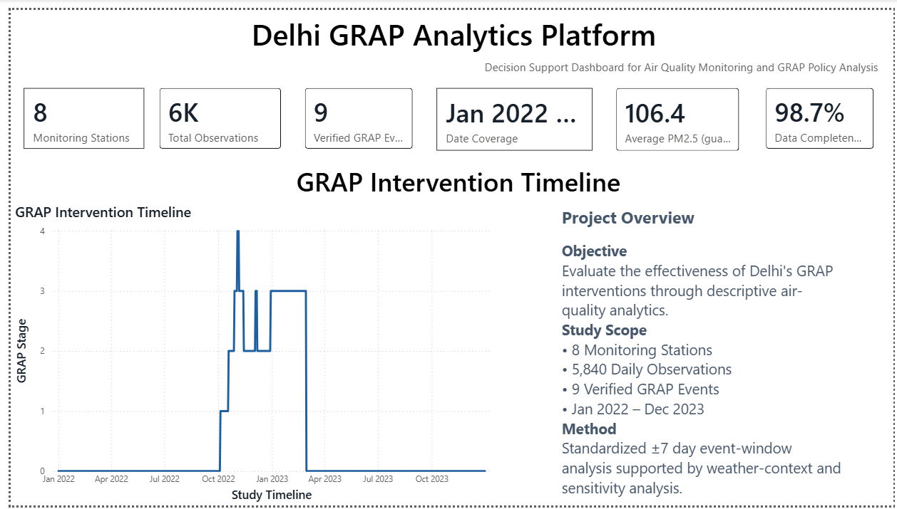
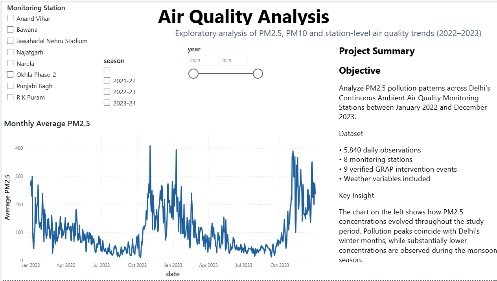
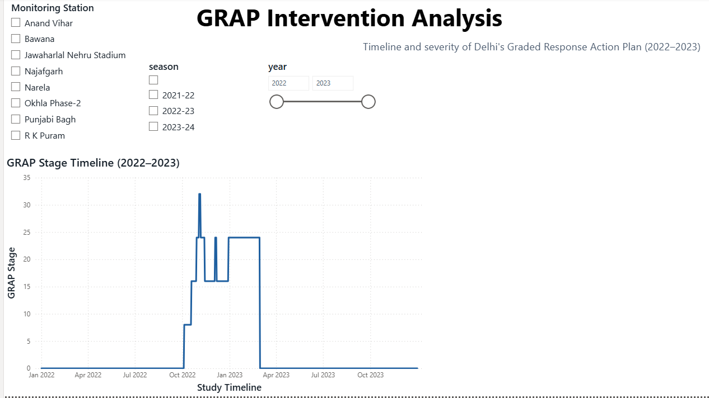
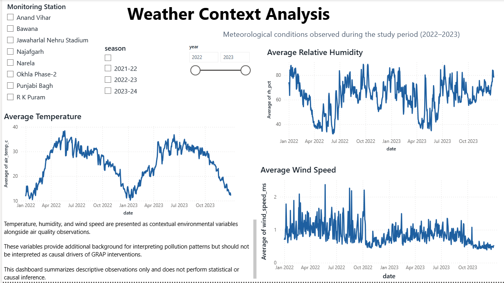
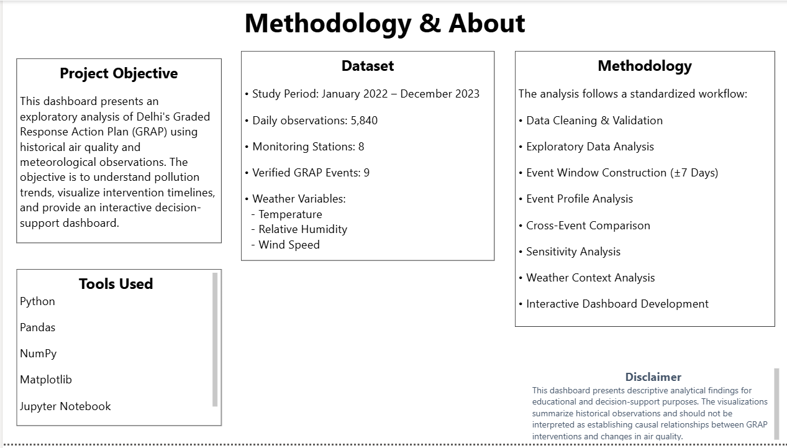
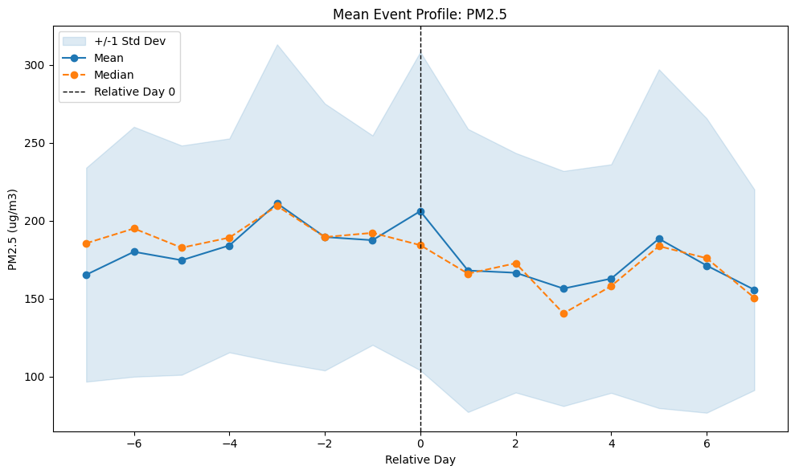
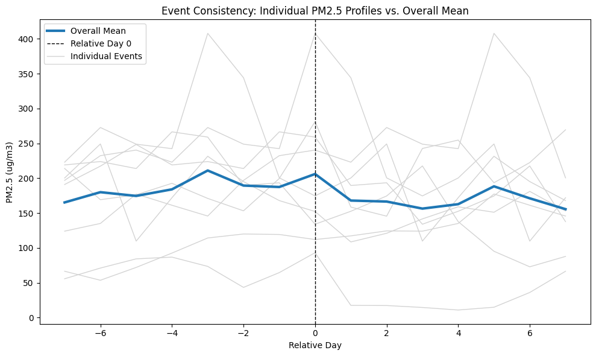

# Delhi GRAP Analytics Platform

An end-to-end analytics platform examining how Delhi's air quality behaves
around India's Graded Response Action Plan (GRAP) — the policy mechanism that
escalates pollution-control measures as air quality worsens. The platform
covers the full path from raw regulatory sensor data to a validated analytical
dataset, a nine-notebook descriptive analysis, and a five-page Power BI
dashboard.

[](https://www.python.org/)
[](https://pandas.pydata.org/)
[](https://numpy.org/)
[](powerbi/)
[](LICENSE)
[](https://github.com/CodeManiac798/delhi_air_quality_grap)

---

## Table of Contents

- [Dashboard Preview](#dashboard-preview)
- [Motivation](#motivation)
- [Objectives](#objectives)
- [Features](#features)
- [Dataset Overview](#dataset-overview)
- [Methodology](#methodology)
- [Dashboard Pages](#dashboard-pages)
- [Repository Structure](#repository-structure)
- [Installation](#installation)
- [Technologies Used](#technologies-used)
- [Key Insights](#key-insights)
- [Limitations](#limitations)
- [Future Improvements](#future-improvements)
- [Acknowledgements](#acknowledgements)
- [License](#license)

---

## Dashboard Preview

| Executive Overview | Air Quality Analysis |
|---|---|
|  |  |

| GRAP Intervention Analysis | Weather Context Analysis |
|---|---|
|  |  |

| Methodology & About |
|---|
|  |

## Motivation

Delhi's winter air quality is among the most severe of any major city in the
world. GRAP is the Commission for Air Quality Management's graded response to
it: as air quality moves from "Poor" toward "Severe+", progressively stricter
Stage I–IV restrictions come into force, and are relaxed again as conditions
improve. Every escalation and de-escalation is a real, dated policy decision —
but public discussion of whether GRAP "works" is almost never grounded in the
actual station-level pollution data around those specific dates.

This project builds that grounding: a reproducible pipeline from raw
regulatory monitoring data to a dated, verified calendar of GRAP interventions,
and a descriptive analysis of what pollution and weather actually looked like
in the days immediately surrounding each one.

## Objectives

- Build a validated, reproducible dataset from raw CPCB station data with an
  explicit data-quality gate.
- Construct a human-verified, source-cited calendar of GRAP stage changes —
  never scraped or inferred.
- Describe pollution and weather behavior in a standardized window around each
  verified intervention, at the station level and pooled across events.
- Test whether that descriptive picture holds up under a different window
  width, rather than reporting a single unexamined choice.
- Present the findings in a decision-support dashboard built for a non-technical
  audience, without overstating what a descriptive study can support.

## Features

- **Gated data pipeline** — nine ordered scripts turn 16 raw CPCB files into a
  validated analytical dataset, with an explicit pass/fail data-quality gate
  and a pytest suite covering both the pipeline and the GRAP event validator.
- **Auditable policy calendar** — every GRAP event is entered by hand from an
  official CAQM order against a documented schema
  ([`docs/grap_event_data_contract.md`](docs/grap_event_data_contract.md)),
  never scraped or recalled from memory.
- **Nine-notebook descriptive analysis** — EDA, station comparison, time
  series, event-window construction, per-event profiles, cross-event
  consistency, sensitivity analysis, and weather context, each scoped to
  answer one question and stay inside it.
- **Sensitivity-checked findings** — the core event-window result is
  re-tested at three window widths (±5, ±7, ±10 days) before being reported,
  not asserted from a single arbitrary choice.
- **Five-page Power BI dashboard** — a semantic model with a documented star
  schema, a validated colorblind-safe theme, and a measure catalogue, built
  from a written architecture and design system rather than ad hoc.
- **Optional SQL analytical layer** — a SQLite warehouse and 15 prepared,
  documented queries as an alternative path into the same validated data.

## Dataset Overview

| | |
|---|---|
| Observations | 5,840 station-days |
| Monitoring stations | 8 (CPCB/DPCC-operated, across Delhi-NCR) |
| Time span | January 2022 – December 2023 (2 full calendar years) |
| Verified GRAP events | 9, human-verified against official CAQM orders |
| Event window | Standardized ±7 days around each event (1,080 event-window rows) |
| Primary outcome | PM2.5 (µg/m³); secondary: PM10 |
| Weather covariates | Temperature, relative humidity, wind speed, wind direction |

**Selected stations:**

| Station | Geographic role |
|---|---|
| Narela | Northern edge |
| Bawana | Outer north-west |
| Anand Vihar | East |
| Punjabi Bagh | West |
| R K Puram | South |
| Okhla Phase-2 | South-east |
| Najafgarh | South-west edge |
| Jawaharlal Nehru Stadium | Central |

*A ninth candidate station, Alipur, was excluded before any outcome analysis:
its 2023 wind-speed field was missing for all 365 days, failing a
pre-declared data-quality rule.*

## Methodology

```
Raw CPCB data (16 files)
        │
        ▼
Validation  ──  src/01–02, Gate 1 structural + missingness checks
        │
        ▼
Engineering  ──  src/03–09, canonical station-day dataset + GRAP state merge
        │
        ▼
Exploratory analysis  ──  notebooks/01, 04, 05 (distributions, stations, time series)
        │
        ▼
Event-window construction  ──  notebooks/06 (±7-day panel around each event)
        │
        ▼
Event & cross-event analysis  ──  notebooks/07–08 (per-event profiles, consistency)
        │
        ▼
Sensitivity & weather context  ──  notebooks/09–10 (window-width check, weather)
        │
        ▼
Power BI dashboard  ──  powerbi/ (semantic model + 5-page report)
```

Every stage is described in more detail in [`docs/analysis_plan.md`](docs/analysis_plan.md),
written *before* the event-window notebooks and used as the standard they are
checked against. The analysis is explicitly **descriptive, not causal** — see
[Limitations](#limitations).

## Dashboard Pages

| Page | Purpose |
|---|---|
| **Executive Overview** | Orientation: study-wide KPIs, a GRAP-stage timeline across the full study period with every verified event marked, and a plain-language project summary. |
| **Air Quality Analysis** | Pollution trend exploration by station and season. |
| **GRAP Intervention Analysis** | Event-relative pollution behavior around the 9 verified interventions. |
| **Weather Context Analysis** | Temperature, humidity, and wind speed alongside pollution over the same windows — the weather backdrop every event-window figure should be read against. |
| **Methodology & About** | Research question, data sources, methodology summary, and limitations, written for a first-time viewer. |

The semantic model, DAX measure catalogue, and page-by-page design rationale
are documented in [`docs/powerbi_architecture.md`](docs/powerbi_architecture.md)
and [`docs/dashboard_design_system.md`](docs/dashboard_design_system.md).

## Repository Structure

```
delhi-aqi-grap/
├── README.md
├── LICENSE
├── requirements.txt
├── .gitignore
│
├── data/
│   ├── raw/
│   │   ├── cpcb/              # 16 untouched CPCB station-day CSVs
│   │   ├── grap/               # human-verified GRAP event calendar
│   │   └── weather/             # reserved for future supplementary weather data
│   └── processed/               # validated, derived analytical datasets
│
├── notebooks/                   # 8 descriptive-analysis notebooks
├── src/                          # data engineering pipeline (9 ordered scripts)
├── tests/                        # pytest suite
├── sql/                          # optional SQLite analytical layer
├── reports/data_quality/         # generated data-quality audit reports
├── figures/                      # static chart exports from the notebooks
│
├── powerbi/                      # Power BI project (.pbip), theme, measures
│   └── screenshots/               # dashboard page exports
│
└── docs/                         # methodology, data dictionary, semantic model
    └── archive/                   # superseded planning documents
```

## Installation

Requires Python 3.10+ and, for the dashboard, Power BI Desktop (Windows).

```bash
git clone https://github.com/CodeManiac798/delhi_air_quality_grap.git
cd delhi_air_quality_grap
python -m pip install -r requirements.txt
```

**Rebuild the dataset from raw data:**

```bash
python src/01_inventory_raw_data.py
python src/02_audit_data_quality.py
python src/03_build_station_daily.py
python src/04_validate_grap_events.py
python src/06_build_daily_grap_state.py
python src/07_validate_daily_grap_state.py
python src/08_merge_station_daily_grap.py
python src/09_validate_merged_dataset.py
python -m pytest -q
```

This produces `data/processed/station_daily_grap.csv` (5,840 rows) and the
other datasets described in [`docs/data_dictionary.md`](docs/data_dictionary.md).
The processed CSVs are already committed, so this step is only needed to
reproduce them from scratch.

**Optional — build the SQL warehouse:**

```bash
python src/05_load_sqlite.py
```

Builds `data/processed/delhi_aqi_grap.db`, a derived SQLite warehouse for the
15 prepared queries under [`sql/`](sql/). Not required for the notebooks or
dashboard, which read the CSVs directly.

**Run the notebooks:**

```bash
jupyter notebook notebooks/
```

Run in numeric order (`01`, then `04`–`10`); each assumes the processed
datasets already exist.

**Open the dashboard:** open `powerbi/Delhi_GRAP_Analytics_Platform.pbip` in
Power BI Desktop. See [`powerbi/README_powerbi.md`](powerbi/README_powerbi.md)
for the build manual if reconstructing it from source.

## Technologies Used

| Category | Tools |
|---|---|
| Language | Python 3.13 |
| Data manipulation | pandas, NumPy |
| Visualization | Matplotlib |
| Notebooks | Jupyter |
| Testing | pytest |
| Business intelligence | Power BI Desktop, DAX, Power Query (M) |
| Database | SQLite, SQL |
| Version control | Git |

## Key Insights

All findings below are descriptive and pooled/summarized from the notebooks —
see [`notebooks/08_cross_event_analysis.ipynb`](notebooks/08_cross_event_analysis.ipynb),
[`09_sensitivity_analysis.ipynb`](notebooks/09_sensitivity_analysis.ipynb), and
[`10_weather_context_analysis.ipynb`](notebooks/10_weather_context_analysis.ipynb)
for the full computation and caveats behind each one.



- **The pooled PM2.5 average is lower in the seven days after a verified event
  than in the seven days before it** — roughly 185 µg/m³ pre-window versus
  167 µg/m³ post-window, pooled across all 9 events and 8 stations. This
  direction holds when the window is narrowed to ±5 days or widened to ±10
  days, though the size of the gap shrinks as the window widens (roughly
  21 → 18 → 10 µg/m³), which is itself part of the finding, not a caveat to
  it.



- **Individual events vary substantially around that pooled average.** Six of
  the 9 verified events show a lower mean PM2.5 in their post-window than
  their pre-window; three show a higher one. At several points in the window,
  the spread between the highest and lowest event exceeds 300 µg/m³ — larger
  than the pooled average itself at that point.

- **Weather moves across the same window pollution does.** Wind speed rises
  gradually into the event day and eases afterward; temperature declines
  steadily across the full 15-day window with no sharp shift at the event day
  itself — consistent with the window sitting inside Delhi's ordinary winter
  cooling trend rather than a policy-triggered change. Neither pattern is
  offered as an explanation for the PM2.5 pattern above; they are reported
  side by side so a reader can weigh them together.

## Limitations

This is a **descriptive study, not a causal-inference study**. It does not
claim, and will not claim, that GRAP caused any pollution change, that GRAP
succeeded or failed, or that weather has been fully controlled for.

- **Nine verified events, one GRAP season.** All 9 events fall within the
  2022-23 season; no events from 2023-24 are yet verified and loaded.
- **No control group.** Every station experiences the same city-wide GRAP
  stage at the same time — there is no station observed under "no GRAP" on the
  same dates for comparison.
- **Overlapping event windows.** Several events are only 3–9 days apart, so
  their ±7-day windows overlap; this is documented and handled explicitly in
  the cross-event analysis rather than hidden.
- **Weather is shown, not controlled.** Temperature, humidity, and wind speed
  are reported alongside pollution, not partialed out of it.
- **Station coordinates are unverified**, so the dashboard has no map view.
- **AQI is out of scope** — PM2.5 is the primary outcome, matching the
  variable GRAP's health rationale is built around.

The full protocol, including which claims the study design *does* support, is
in [`docs/analysis_plan.md`](docs/analysis_plan.md).

## Future Improvements

- Extend the verified GRAP calendar to the 2023-24 season as official orders
  become available, enabling a genuine across-season comparison.
- Source verified station coordinates to enable a map view and spatial
  analysis.
- Add a formal weather-adjustment model as a complement to the current
  side-by-side weather context view.
- Extend the sensitivity analysis to a continuous sweep of window widths
  rather than three fixed points.
- Add continuous integration to run the test suite and rebuild the dataset on
  every push.
- Build out the remaining dashboard interaction patterns specified in
  [`docs/dashboard_design_system.md`](docs/dashboard_design_system.md) (
  drillthrough pages, bookmarked filter panel) beyond what is implemented today.

## Acknowledgements

- **Central Pollution Control Board (CPCB)** and the **Delhi Pollution Control
  Committee (DPCC)** for the station monitoring data.
- **Commission for Air Quality Management (CAQM)** for the official GRAP
  orders that make up the verified event calendar.

## License

Code (pipeline scripts, notebooks, SQL, DAX, and the Power BI project) is
released under the [MIT License](LICENSE). Raw monitoring data originates from
CPCB/DPCC, a public government body, and is included for reproducibility; it
is not covered by the MIT grant.
